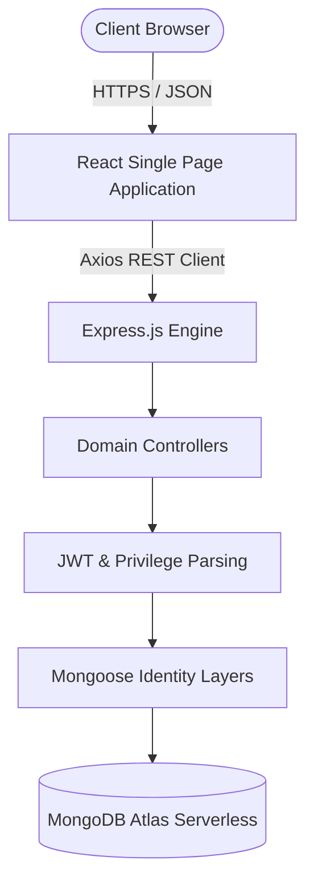
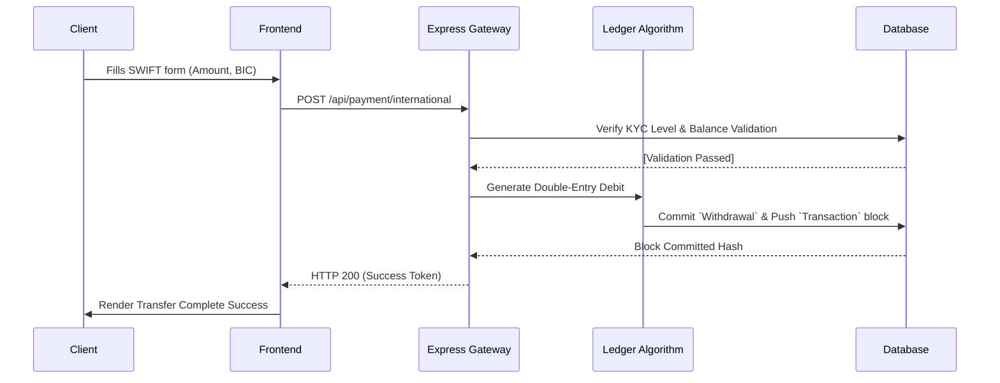

# 🏦 NexBank - Secure FinTech & Neo-Banking Platform


NexBank is a highly scalable, secure, and fully-featured Neo-Banking platform designed to simulate enterprise-grade financial infrastructure. Built entirely on the MERN stack, this ecosystem replaces legacy digital wallets with a robust double-entry ledger system, multi-currency live foreign exchange pricing, administrative KYC enforcement, and dynamic role-based dashboards.

---

## 📖 Table of Contents
1. [Core Features](#-core-features)
2. [Dual-Role Application Interfaces](#-dual-role-application-interfaces)
3. [System Architecture & Dataflow](#-system-architecture--dataflow)
4. [API Architecture & Routes](#-api-architecture--routes)
5. [Directory Structure](#-directory-structure)
6. [Installation & Local Setup](#-installation--local-setup)

---

## ✨ Core Features

* **Banking Identifiers:** Every user is automatically provisioned a unique 12-digit Account Number and a routing IFSC Code (`NEXB0000001`).
* **Global Money Hub:** Unified Transfer module containing 4 distinct corridors:
  * **Funding Simulator:** Inject funds directly into the ledger effortlessly (bypasses physical payment gateway KYC).
  * **Internal Transfer:** Zero-fee P2P wallet transfers between NexBank accounts.
  * **Domestic Transfer (IMPS):** Expedited national payouts via simulated clearing houses.
  * **International Transfer (SWIFT):** Cross-border wire transfers with real-time FX calculation.
* **Live FX Pricing Engine:** Integrates a "Wise-style" currency calculator that accurately applies mid-market exchange rates and platform margins dynamically.
* **Double-Entry Operations Ledger:** Immutable transactional tracking, enforcing mathematical integrity between user debits and credits.
* **Universal Security Configuration:** Decoupled Settings environment supporting separate routes for Users (`/settings`) and Admins (`/admin/settings`).

---

## 🎭 Dual-Role Application Interfaces

The Frontend React application uses implicit JSON Web Tokens (`JWT`) context switching to render different realities based on your assigned database string literal (`userRole`).

### 👤 Standard User Configuration
* **Dashboard:** Tracks Available Balance via live charting algorithms, visualizes the 30-day velocity metric, and provides explicit quick-actions.
* **Transaction History:** Comprehensive ledger receipt indexing.
* **Profile Configuration:** Change Passwords with Bcrypt-secured rotation parameters and manage email associations.

### 🛡️ Global Console Configuration
* **Superadmin View:** Administrators can monitor the platform's Total System Liquidity and KYC Pipeline Analytics.
* **KYC Repository:** Admins approve/reject pending identity document verifications.
* **Transaction Review:** Manual queue for transactions flagged by internal AML (Anti-Money Laundering) directives.
* **System Modifiers:** Flip platform behavior via global toggles (e.g., *Strict AML Enforcement*, *Maintenance Mode*).

---

## 🏗 System Architecture & Dataflow

### 1. High Level Abstraction
The application utilizes a classic MERN 3-tier REST architecture with aggressive middleware intervention for security and routing accuracy.



### 2. The SWIFT Execution Pipeline
The following represents the ledger dataflow when a user processes an International Wire Transfer.



---

## 🛣️ API Architecture & Routes

NexBank adheres strictly to RESTful conventions. Protected endpoints demand a `Bearer Token`. 

### Security & Authentication
| Method | Endpoint | Description |
|---|---|---|
| `POST` | `/api/auth/register` | Provisions Account + Banking Codes |
| `POST` | `/api/auth/login` | Returns dual-role JWT |
| `GET` | `/api/auth/profile` | Fetches session identity |

### Transfer & Ledger Engineering
| Method | Endpoint | Authorization |
|---|---|---|
| `POST` | `/api/payment/fund-simulator` | User (Injects pure deposit testing funds) |
| `POST` | `/api/payment/internal` | User (Processes NexBank specific offsets) |
| `POST` | `/api/payment/domestic` | User (Logs IMPS simulation) |
| `POST` | `/api/payment/international` | User (Parses FX Math & executes Wire) |
| `GET` | `/api/payment/calculateFX` | Public (Yields Mid-market Rates + Margin) |

### Privilege Endpoints
| Method | Endpoint | Authorization |
|---|---|---|
| `GET` | `/api/users/admin/stats` | `isAdmin` (Fetches system elasticity) |
| `PUT` | `/api/kyc/:id/status` | `isAdmin` (Approves document flow) |

---

## 📂 Directory Structure

```text
net-banking-system/
├── backend/                  # Express / Node.js Backbone
│   ├── config/               # DB drivers 
│   ├── controllers/          # Business logic (Auth, Payment, Users)
│   ├── middleware/           # Interceptors (JWT Parser, Admin Boundary)
│   ├── models/               # Mongoose Object Mappers
│   ├── routes/               # Express Endpoint Mounting
│   └── server.js             # Initialization Kernel
├── frontend/                 # React UI Architecture
│   ├── public/               # Static assets
│   └── src/
│       ├── components/       # Reusable chunks (Modals, Navbars, ContextProviders)
│       ├── context/          # Global state logic (ThemeContext)
│       ├── pages/            # Routable Interface Clusters (Transfer, Dashboard, Settings)
│       ├── utils/            # Axios API wrappers
│       ├── App.jsx           # Master DOM Node (React Router Hub)
│       └── index.css         # Foundational CSS directives (Tailwind + Custom)
└── package.json              # Repo dependencies
```

---

## 🛠️ Installation & Local Setup

### 1. Prerequisites 
- Node.js `^18.0.0`
- MongoDB Native or MongoDB Atlas URI string.

### 2. Environment Configuration
Create a `.env` configuration file inside `/backend/`:
```env
PORT=6500
MONGO_URI=mongodb+srv://<user>:<pwd>@cluster.mongodb.net/nexbank?retryWrites=true&w=majority
JWT_SECRET=super_secret_key_123
```

### 3. Execution
**Run Backend:**
```bash
cd backend
npm install
npm run dev
```

**Run Frontend:**
```bash
cd frontend
npm install
npm run dev
```

Navigate to `http://localhost:5173` locally. The platform will automatically connect to your backend environment running on `http://localhost:6500`.
